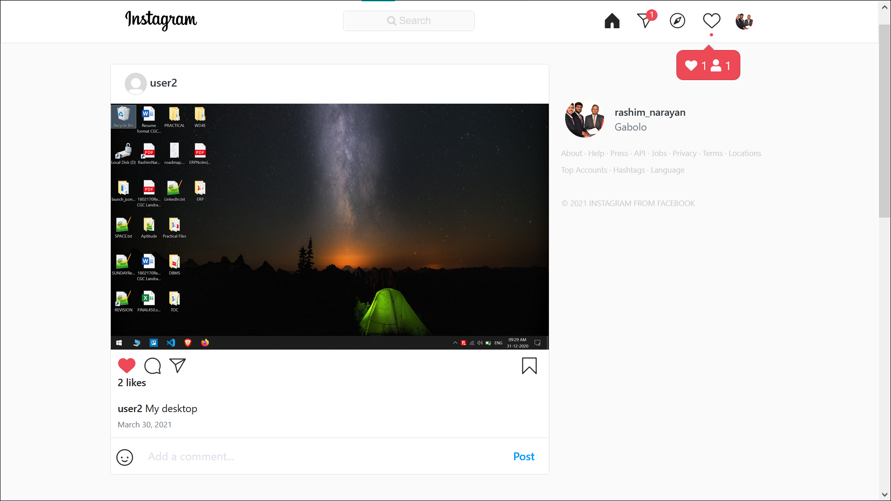

# Instagram
It is a fully functional and responsive Instagram web clone made in Django.

The frontend is made with HTML, CSS/Bootstrap and JS/Jquery

## Features

### *Profile*
* Login/Signup page
* Facebook Authentication
* Profile page
* Saved Post Page
* Edit Profile
* Password change
* E-mail Password Reset

### *Instagram Feeds*
* Infinite scrolling posts
* Add New Posts
* Profile Search
* Single Post Page
* Dynamic Like and Save posts
* Comments and reply to comments
* Share post to others
* Explore Page

### *Message System*
* Messages Page
* Search people to message
* Send/Recieve messages in real-time
* Message Notification counter on top

### *Notification System*
* Real-time Message Notification
* Notification Panel and Popup notification for Like, Comment and follow.

## Images
### Signup Page

### Home Page

### Profile Page

### Messages Page

My Role:
--------
This project is a major project and Me and My partner(Rashim Narayan Tiku) have used two languages (Java and Python) for back-end programming. My role was to make the coding in Python and Java programming was implemented by my partner. We both divided the work of designing the front-end by using HTML. 

Difficulties:
-------------
The difficulties that we faced in this project were in 'Notification System' and 'Message System'. We wre not able to implement these features properly. We were not getting the fresh notifications and messages. So we implemeted some machine learnign algorithms by using Python language such IMPS.

## Credit
Almost every logo/Image (except profile pictures and posts) are the property of Facebook, Inc. and I am in no way intenting to call it as my own.

### *Imitation is the highest form of Flattery*
